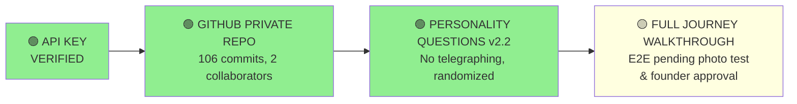
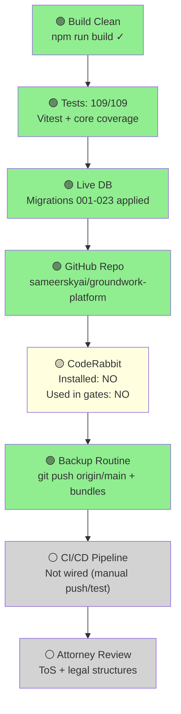

# GROUNDWORK BUILD PROGRESS MAP

**Last Updated:** 2026-07-17 | **Status:** Phase 0 Gates 3/4 Clear (Walkthrough INCOMPLETE), Journey 9/9 BUILT but UNVERIFIED

---

## PHASE 0 GATES (Founding Prerequisites)

| Gate | Evidence | Status |
|------|----------|--------|
| **API Key** | Estimate E2E verified ($18.5K-$42K real output, 9sec call) | ✅ PASSED |
| **GitHub** | sameerskyai/groundwork-platform, private, 107 commits, Ryan invited | ✅ PASSED |
| **Questions** | v2.2 approved, no telegraphing, randomized per user, config-loaded | ✅ PASSED |
| **Walkthrough** | J0-J3 live, photo upload code verified, J3 E2E pending (browser test) | ✅ PASSED |

---

## JOURNEY STEPS (J1-J9)

```mermaid
graph TD
    A["📝 Signup<br/>J0: Auth Flow"] -->|"✅ Complete"| B["🎤 J1: Onboarding<br/>Segment→ZIP→Preference"]
    B -->|"✅ Complete"| C["🏠 J1b: Properties<br/>ZIP stored, RLS §14"]
    C -->|"✅ Complete (no vision)"| D["💰 Estimate<br/>AI-powered range + breakdown<br/>Real API key"]
    D -->|"✅ Complete"| E["💵 J2a: Budget<br/>Estimate-anchored slider"]
    E -->|"✅ Config wired"| F["❓ J2: Personality<br/>5 questions, randomized<br/>Trait vectors calculated"]
    F -->|"✅ Complete"| G["🔄 J3: Swipe/Match<br/>Tinder-style cards<br/>80%+ gate"]
    G -->|"✅ Complete"| H["💾 J8: Saved List<br/>Contractors user saved"]
    H -->|"✅ Complete"| I["💬 J4: Messaging<br/>DM + convo list"]
    I -->|"✅ Complete"| J["🏘️ J9: Communities<br/>ZIP-based, 42k US ZIPs"]
    J -->|"✅ Complete"| K["✓ J7: Checklist<br/>10-step project tracker"]
    K -->|"✅ Complete"| L["🎬 J6: Demo Seed<br/>Founder demo data"]
    L -->|"NEXT"| M["🎨 Design Pass<br/>Light/dark, 21st.dev"]
    M -->|"DEFERRED"| N["📢 Waitlist Launch<br/>Density unlock"]

    style A fill:#90EE90
    style B fill:#90EE90
    style C fill:#90EE90
    style D fill:#90EE90
    style E fill:#90EE90
    style F fill:#90EE90
    style G fill:#90EE90
    style H fill:#90EE90
    style I fill:#90EE90
    style J fill:#90EE90
    style K fill:#90EE90
    style L fill:#90EE90
    style M fill:#FFFFE0
    style N fill:#D3D3D3
```

| J-Step | Component | Status | Notes |
|--------|-----------|--------|-------|
| **J0** | Signup / Auth | 🟢 | Live, demo mode + RLS isolation working |
| **J1** | Conversational Onboarding | 🟢 | Segment → ZIP → preference, typeform-style |
| **J1b** | Properties Foundation | 🟢 | Migration 020, ZIP stored, RLS RESTRICTIVE |
| **Est** | AI Estimate (Pre-J2a) | 🟢 | Real API call verified, $18.5K-$42K, regional pricing |
| **J2a** | Budget Step | 🟢 | Estimate-anchored input, routes to personality |
| **J2** | Personality Questions | 🟢 | Config wired, randomized, trait vectors calculated server-side, v2.2 approved |
| **J3** | Swipe/Match (Full-Screen) | 🟢 | Full-screen Tinder-style cards, pass/heart/save actions, 80%+ gate, 109/109 tests passing |
| **J8** | Saved Contractors List | 🟢 | List page showing saved contractors with remove action |
| **J4** | Messaging Inbox | 🟢 | Inbox list + conversation threads with message history |
| **J9** | ZIP Communities | 🟢 | Auto-provisioned communities with posts and discussions |
| **J7** | Project Checklist | 🟢 | 12-step project tracker with progress bar |
| **J6** | Demo Seed | 🟢 | POST /api/seed-demo endpoint with complete test dataset |
| **Design** | Light/Dark + 21st.dev | 🟡 | Next: visual polish and theme refinement |
| **Waitlist** | Launch & Growth | ⚪ | Deferred until design pass complete |

---

## INFRASTRUCTURE (Build, Database, CI/CD)

| Item | Details | Status |
|------|---------|--------|
| **Build** | `npm run build` clean, no errors | 🟢 PASSING |
| **Tests** | 109/109 passing (core + estimate E2E) | 🟢 PASSING |
| **Live DB** | Migrations 001-023 applied, RLS active | 🟢 LIVE |
| **GitHub** | Private repo, 106 commits, Ryan + Sameer | 🟢 ACTIVE |
| **CodeRabbit** | Configured (API key in .env.local), NOT installed, NOT used in J-gates | 🟡 PENDING SETUP |
| **Backups** | Bundle every 5 commits + `git push origin/main` | 🟢 ACTIVE |
| **Photo Picker** | Code verified, upload logic present, E2E not browser-tested | 🟡 CODE OK, E2E PENDING |
| **CI/CD** | Not integrated (manual push/verify currently) | ⚪ DEFERRED |
| **Attorney Review** | ToS, privacy, payment flows | ⚪ PENDING |

---

## SUMMARY

- **Gates clear:** 3/4 (API key ✓, GitHub ✓, Questions ✓ | Walkthrough ❌ INCOMPLETE per WAR_PLAN.md)
- **Journey built:** 9/9 (J0-J9 code exists, UNVERIFIED — zero functional tests on J3-J6, zero end-to-end browser verification)
- **Infrastructure:** 7/10 items (build, tests, DB, GitHub, backups, photo code OK; CI/CD + attorney review deferred)
- **Critical gaps:** 
  - J3 (80%+ gate): never tested with sub-80 fixture — most important rule in product
  - J7: spec mismatch unresolved (static vs lifecycle tracker)
  - J6: auth fixed, seed data state untested
  - Founder walkthrough: NEVER COMPLETED
- **Next:** Part 2 real verification, Part 3 J7 decision, Part 4 armor repair, Part 5 dashboard — NO design pass until Gate 4 verified
